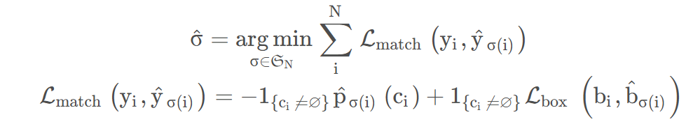

# FCN

FCN将传统CNN后面的全连接层换成了卷积层，这样网络的输出将是热力图而非类别;为解决卷积和池化导致图像尺寸的变小，使用上采样方式对图像尺寸进行恢复。

**核心思想：** 

- 不含全连接层的全卷积网络，可适应任意尺寸输入；
- 反卷积层增大图像尺寸，输出精细结果；
- 结合不同深度层结果的跳级结构，确保鲁棒性和精确性。

# UNet

创建一个全卷积网络，fully convolution network来用于提取出相应的特征。网络只需要少量的训练数据并且可以有更高的分割准确率

# DeepLab

### DeepLab v1

DeepLab V1是基于VGG16网络改写的。 首先，去掉了最后的全连接层。然后，去掉了最后两个池化层，引入空洞卷积。最后引入条件随机场CRF提高分类精度。

### DeepLab v2

更加灵活的使用了atrous convolution，提出了空洞空间金字塔池化ASPP。利用空洞卷积的优势，从不同的尺度上提取特征。

### DeepLab v3

# PSPNet

核心关键在于**PSP Block**， 采用了步长不同，pool_size不同的平均池化层进行池化，然后将池化的结果重新resize到一个hw上后，再concatenate。

# Mask R-CNN

**RCNN**

- 在网络的底部，基于非深度学习的选择性搜索 (SS) 用于特征提取以生成 2k 区域建议。
- **每个rigion proposall（区域提案）** 都经过扭曲并通过卷积神经网络（CNN）和最后的支持向量机（SVM），输出分类和边界框。

**Fast RCNN**

- 在Fast R-CNN中，区域提议部分仍然使用基于非深度学习的 SS 方法，SS 仍然用于生成 2k 个区域建议。
- 但是，与R-CNN不同的是，输入整张图像（而非每一个区域）经过 CNN 进行特征提取以生成特征图（这样就相当于共享了参数，提高了速度）。之后根据每个区域提议共享这些特征图以用于 RoI 池化。
- 对于每个region proposal，在proposal上执行 RoI 池化，最终通过网络，即全连接（FC）层。并且不再使用 SVM。
- 最后，在全连接（FC）层的输出端输出分类和边界框。

**ROI pooling和ROI Aligin的区别：**

- ROI Pooling首先将输入图像的不同尺度的候选区域映射到特征图上，然后将映射后的特征区域分割成相同大小的网格，最后对每个网格进行**最大池化操作**。在这个过程中，候选区域边界被量化为整数坐标，**导致边界处的像素信息可能丢失或错位**，尤其是当ROI边界不是网格对齐时。
- ROI Align主要为了解决ROI Pooling中的量化问题。它不直接对ROI边界进行量化，而是直接使用候选框的浮点坐标。在每个ROI内部，ROI Align将区域划分为多个bins（或称为cells），并且在每个bin中计算固定数量（通常是4）的采样点的特征值，通过**双线性插值方法**得到这些采样点的精确特征值，然后再进行平均或最大池化操作。这一步骤避免了由于量化引起的不精确匹配问题。

**Faster RCNN**

- 在Faster RCNN中，输入图像通过 CNN。这些特征图将用于区域提议网络（RPN）以生成区域提议，并用于生成特征图以用于稍后的 RoI 池化。
- 不再使用SS。 因此，整个网络是一个端到端的深度学习网络，对于梯度传播提高目标检测精度至关重要。

**RPN：**在特征图上应用一个滑动窗口的卷积操作（通常是3x3卷积），得到一个中间特征图。从中间特征图中再通过两个1x1卷积层，分别进行分类（objectness score）和回归（bounding box regression）操作。

**Mask RCNN**

Mask RCNN，架构非常接近Faster RCNN。**主要区别在于，在网络的末端，还有另一个头，即上图中的掩码分支，用于生成掩码进行实例分割。还有把Faster RCNN中的ROI Pooling换成了ROIAlign。**

# YOLO

**yolo v3**

YOLOv3的一个基本特征是多尺度预测，即在多个网格尺寸下的预测。这有助于获得更精细的方框，并大大改善了对小物体的预测.

# DETR

**没有非极大值抑制 NMS 后处理步骤、没有 anchor 等先验知识和约束，整个由网络实现端到端的目标检测实现，大大简化了目标检测的 pipeline**。

DETR 分为四个部分，首先是一个 CNN 的 backbone，Transformer 的 Encoder，Transformer 的 Decoder，最后的预测层 FFN。

- 目标检测的图一般比较大，那么直接上 Transformer 计算上吃不消，所以先用 CNN 进行特征提取并缩减尺寸;
- 此时自注意力机制在特征图上进行全局分析，**因为最后一个特征图对于大物体比较友好**。
- 分类的时候都是给一个 class token，因为只进行一类预测。最简单的做法就是给超多的查询 token，对应的 Transformer decoder 也就会输出 100 个经过注意力和映射之后的 token，然后将它们同时喂给一个 FFN 就能得到 100 个框的位置和类别分数。
- 与 ViT 他们不同的另外一点是，DETR 的** Decoder 也加了 Positional Encoding**。
- FFN 预测框标准化中心坐标，高度和宽度，然后使用 softmax 函数激活获得预测类标签。
- 二分图匹配：DETR 预测了一组固定大小的 N = 100 个边界框，这比图像中感兴趣的对象的实际数量大得多。

# SETR

CNNs难以学习长距离依赖关系，而这种关系对语义分割至关重要。

- 直接修改卷积操作：大卷积核、空洞卷积、图像/特征金字塔等；
- 引入注意力模块，对feature map中各个像素建模全局上下文信息。

- Encoder部分对输入图像做卷积进行降维，再经过Transformer Block
- Decoder部分对Encoder的输出reshape后做上采样操作

# Deformable DETR

DETR优点：消除了anchor和nms；

DETR的缺点：

- 收敛慢：训练起来非常慢，至少要训练500个epoch
- 计算量大：对小目标性能很不好

DCN（Deformable Convolution Networks）：在卷积当中引入了学习空间几何形变的能力，不再是使用常规的领域矩阵卷积，而是让卷积自动的去学习需要需要卷积的周围像素，以此可以适应更加复杂的几何形变任务。

那么很朴素的想法就是：让每个位置不必和所有位置交互计算，只需要和部分（学习来的，重要的部分）进行交互即可。

Deformable Attention Module主要思想是结合了DCN和自注意力，目的就是为了通过在输入特征图上的参考点(reference point)附近只采样少数点(deformable detr设置为3个点)来作为注意力。

**多尺度位置编码：** 对每个尺度加入一个可学习的位置编码，在绝对位置编码的基础上加上可学习的位置编码

# Swin Transformer

问题：

- 现有的基于 Transformer 的模型中，token 的尺度 (scale) 都是固定的，这是一种不适合这些视觉应用的性质。
- 存在许多视觉任务 ，如语义分割，需在像素级别上进行密集预测，这对于高分辨率图像上的 Transformer 而言是难以处理的，因为其 **自注意力的计算复杂度是关于图像大小的二次方**。

为产生一个 **层次化表示 (Hierarchical Representation)**，随着网络的加深，tokens 数逐渐通过 ***Patch 合并层 (Patch Meraging)*** 被减少，即在维度方向上拼接相邻的2*2的token，在经过MLP进行降维到2C。

